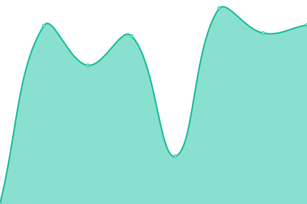
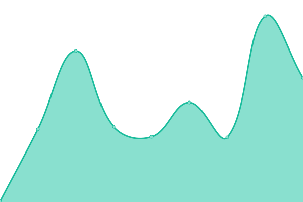
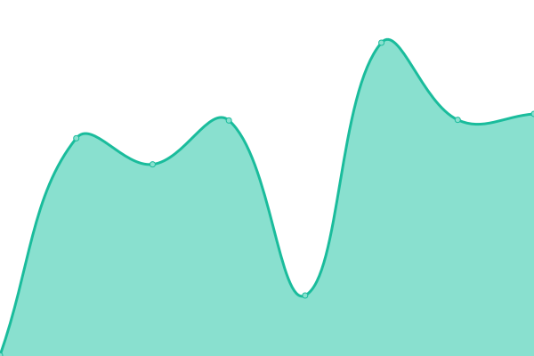

# [📈 Live Status](https://t2noob.github.io/SL): <!--live status--> **🟩 All systems operational**

This repository contains the open-source uptime monitor and status page for [t2noob](https://t2noob.github.io/SL), powered by [Upptime](https://github.com/upptime/upptime).

With [Upptime](https://upptime.js.org), you can get your own unlimited and free uptime monitor and status page, powered entirely by a GitHub repository. We use [Issues](https://github.com/t2noob/SL/issues) as incident reports, [Actions](https://github.com/t2noob/SL/actions) as uptime monitors, and [Pages](https://t2noob.github.io/SL) for the status page.

<!--start: status pages-->
<!-- This summary is generated by Upptime (https://github.com/upptime/upptime) -->
<!-- Do not edit this manually, your changes will be overwritten -->
<!-- prettier-ignore -->
| URL | Status | History | Response Time | Uptime |
| --- | ------ | ------- | ------------- | ------ |
|  URBINA EMAIL | 🟩 Up | [urbina-email.yml](https://github.com/t2noob/SL/commits/HEAD/history/urbina-email.yml) | 

 120ms
     
 | 

<a href="https://t2noob.github.io/SL/history/urbina-email">100.00%</a>
    

|  Second Server | 🟩 Up | [second-server.yml](https://github.com/t2noob/SL/commits/HEAD/history/second-server.yml) | 

 115ms
     
 | 

<a href="https://t2noob.github.io/SL/history/second-server">100.00%</a>
    

|  Private Bin | 🟩 Up | [private-bin.yml](https://github.com/t2noob/SL/commits/HEAD/history/private-bin.yml) | 

 107ms
     
 | 

<a href="https://t2noob.github.io/SL/history/private-bin">100.00%</a>
    

<!--end: status pages-->

[**Visit our status website →**](https://t2noob.github.io/SL)

## 📄 License

- Powered by: [Upptime](https://github.com/upptime/upptime)
- Code: [MIT](./LICENSE) © [t2noob](https://t2noob.github.io/SL)
- Data in the `./history` directory: [Open Database License](https://opendatacommons.org/licenses/odbl/1-0/)
